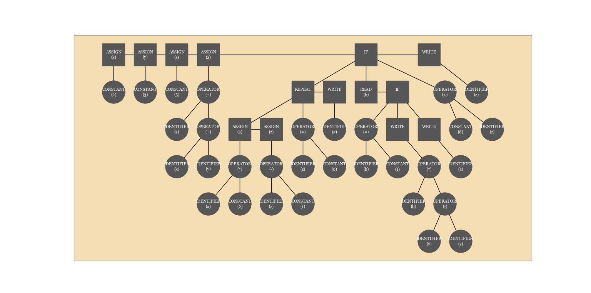

]


# TINY-Language-Compiler
A compiler for a tiny language written in python using pyqt6 for the GUI.

## Table of Contents
1. [Introduction](#introduction)
2. [Installation](#installation)
3. [Usage](#usage)
4. [Example](#example)
5. [Contributing](#contributing)
6. [License](#license)

## Introduction
The Tiny Compiler app is a powerful tool for compiling code written in the Tiny language. It offers a range of features, including syntax highlighting, error checking, and code completion, to help you write and debug your code more efficiently.\
To create an AST, the tool first needs to scan the code and identify the different tokens that make up the program, such as keywords, variables, and operators. It can then use this information to build a tree-like structure that represents the code's syntax and structure.

Once the AST has been generated, it can be used for a variety of purposes. For example, it can be used to analyze the code for errors or to optimize the code for performance. It can also be used to transform the code into a different format, such as translating the code into a different programming language.

Overall, this project involves creating a tool that can analyze and understand the structure of code, which can be useful for a wide range of applications. It may be particularly useful for developers who need to manipulate or analyze code, or for those who are working on projects that involve code translation or optimization.

To use the app, simply open a new file and start writing your code. When you're ready to compile, click the \"Browse\" button to enter your file.

## Installation
To install the Tiny Compiler app,run the exe found in the dist folder.

or 

simply clone the project and run
```bash
python3 GUI.py
```
## Usage
please read the [documentation](Documentation.docx) for more information.

## Example
```tiny language program
x := 2 ;
y := 3 ;
z := 5 ;
a := x+y+z ;
if z < 8 then
repeat
a:= a*2 ;
z:= z-1 
until z = 0 ;
write a
else
read b;
if b = 1 then
write b*(x-y)
else
write a 
end
end ;
write z
```
As a result, the following tree will be generated:



## Contributing
Pull requests are welcome. For major changes, please open an issue first to discuss what you would like to change.

Please make sure to update tests as appropriate.

## License
[MIT](https://choosealicense.com/licenses/mit/)
